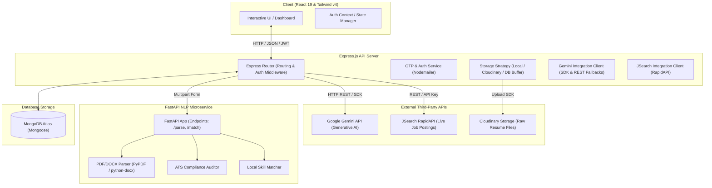

# AI-Powered Resume Matcher & Job Recommender — Detailed Explanation

This document provides a comprehensive technical overview of the **AI-Powered Resume Matcher & Job Recommendation System**. It details the system architecture, core functionalities, database schemas, and generative AI models used to drive resume parsing, ATS auditing, job recommendations, and interview preparation.

---

## 🏗️ System Architecture

The application is structured as a decoupled, multi-tier microservice architecture. It consists of a React Single Page Application (SPA) frontend, an Express.js Gateway/API Server, a Python FastAPI NLP microservice, and third-party integrations (Google Gemini API, Cloudinary, and JSearch API).

### Architectural Diagram



### Dynamic Process Flow

#### 1. Resume Upload & Parsing Sequence
1. The candidate uploads a resume (`.pdf` or `.docx`) via the **React UI**.
2. The **Express Server** receives the file using **Multer** and forwards it as a multipart request to the **FastAPI NLP Service** (`/parse`).
3. The **FastAPI Service**:
   - Extracts raw text using **PyPDF** or **python-docx**.
   - Audits layout, formatting, image content, and sections to calculate an **ATS Score**.
   - Runs heuristic regex engines to parse contact links (GitHub, LinkedIn, Email, Phone).
   - Extracts technical skills matching a localized dictionary of 100+ keywords.
   - Segregates raw text into sections (Experience, Education, Projects, Skills).
   - Computes a composite **Resume Score**.
4. The **Express Server** receives the parsed response and forwards the raw text to **Google Gemini API** to generate a professional candidate summary and five highly-tailored suggestions.
5. Depending on `RESUME_STORAGE_TYPE` in server environment, the raw document is stored:
   - **Local:** Saved in server directory `/uploads`.
   - **Cloudinary:** Saved in Cloudinary cloud raw bucket.
   - **Database:** Encoded as a Base64 string and stored directly inside MongoDB.
6. The compiled parser results, ATS score, and Gemini insights are saved in **MongoDB** under the `Resume` collection and returned to the client dashboard.

---

## 🛠️ Technology Stack

| Component | Technologies & Packages Used |
| :--- | :--- |
| **Frontend** | React 19, Vite, Tailwind CSS v4, Framer Motion (animations), Chart.js (analytics rendering), React Router v6 |
| **Backend Core** | Node.js, Express, Multer (multipart handling), JWT (stateless authentication), Mongoose (Object Data Modeling) |
| **Cloud Services** | Cloudinary (resume file hosting), Gmail SMTP via Nodemailer (registration & recovery OTP delivery) |
| **NLP Microservice** | Python 3, FastAPI, Uvicorn, PyPDF (PDF text & images), python-docx (Word document parsing), Regular Expressions (re) |
| **Generative AI** | Google Gemini API via `@google/generative-ai` SDK and betav1 HTTP REST fallback endpoints |
| **Job Feed Service** | JSearch API via RapidAPI |

---

## ⚙️ Core Functionalities

### 1. User Authentication & Profile Security
*   **Two-Step Registration:** The user submits registration details. An OTP (One Time Password) is sent to the target email. The account is created only after verifying the OTP code.
*   **Stateless Sessions:** Sessions are authenticated with custom JWT signatures containing the payload `user.id`.
*   **Password Reset & Email Updates:** OTP workflow handles forgot-password actions and updating user email addresses securely.
*   **Profile Editor:** Provides settings to update college, branch, graduation year, social handles (GitHub, LinkedIn, LeetCode, Codeforces, HackerRank), skills, certifications, education history, and projects.

### 2. Intelligent Resume Parsing & ATS Audit
*   **Multiformat Parsing:** Converts binary `.pdf` and `.docx` document streams to plaintext.
*   **ATS Compatibility Checklist:** Audits document metrics including:
    *   *Word Count:* Flagging resumes containing $< 150$ words (too short) or $> 1000$ words (too wordy).
    *   *Image Scans:* Checking if a PDF contains scanned image data without readable text elements.
    *   *Page Limits:* Flagging documents exceeding 2 pages.
    *   *Heading Validation:* Testing for existence of standard titles (Experience, Education, Skills).
*   **Composite Resume Scoring:** Combines contact details present, skill density, section boundaries, and ATS checks to output a unified quality percentage (out of 100%).

### 3. Dynamic Job Recommendation Board
*   **Live Scraping & Extraction:** Queries JSearch API in real-time. If the API key is not active, it queries the local MongoDB cache.
*   **Workspace Normalization:** Translates raw job text to standardize salary ranges, locations, experience rules, and workplace types (Remote, Hybrid, Onsite).
*   **Local Skill Matching:** Compares the candidate's profile skills with job specifications in JavaScript to isolate:
    *   *Match Percentage:* The ratio of candidate skills to required job skills.
    *   *Overlapping Skills:* Skills matching the target position.
    *   *Missing Skills:* Requirements the candidate lacks.

### 4. Kanban Job Application Tracker
*   **Lifecycle Management:** Tracks applications through custom states: `Saved`, `Applied`, `Interview Scheduled`, `Rejected`, `Offer Received`.
*   **Custom Notes:** Allows candidates to write interview schedules, contact details, and progress notes.

### 5. AI Copilot (Powered by Google Gemini)
*   **Cover Letter Writer:** Synthesizes candidate skills, branch, and resume history with the job description to output a highly personalized, ready-to-send cover letter.
*   **Bridge-the-Gap Learning Roadmaps:** Generates a structured 5-step learning timeline detailing subjects and specific topics needed to target a new role based on current skill gaps.
*   **Targeted Interview Prep:** Compiles five technical questions customized to the target tech stack and five behavioral questions.

---

## 🗄️ Database Schema

All schemas are declared using Mongoose models mapping to a MongoDB database.

### 1. User Schema (`User.js`)
Stores account authentication fields, profile metrics, academic background, and activity logs.

*   `name` (String, required)
*   `email` (String, required, unique, lowercase, trimmed)
*   `password` (String, required)
*   `college` (String, required)
*   `branch` (String, required)
*   `gradYear` (Number, required)
*   `phone` (String)
*   `skills` (Array of Strings)
*   `education` (Array of sub-documents: `degree`, `school`, `startYear`, `endYear`, `gpa`)
*   `certifications` (Array of Strings)
*   `projects` (Array of sub-documents: `title`, `desc`, `url`, `technologies`)
*   `socialLinks`:
    *   `github`, `linkedin`, `portfolio`, `leetcode`, `codeforces`, `hackerrank` (Strings)
*   `profilePicture` (String URL)
*   `pastSearches` (Array of Strings)
*   `createdAt` (Date, default `Date.now`)

### 2. Resume Schema (`Resume.js`)
Manages extracted files, parsed text, and analytical metrics.

*   `userId` (ObjectId, ref `User`, required, unique)
*   `fileName` (String, required)
*   `filePath` (String)
*   `fileData` (String - Base64 buffer, only populated when storage strategy is set to `database`)
*   `fileMimeType` (String)
*   `cloudinaryId` (String - Cloudinary identifier)
*   `rawText` (String)
*   `parsedData`:
    *   `contact_info`: `email`, `phone`, `github`, `linkedin` (Strings)
    *   `skills` (Array of Strings)
    *   `sections`: `experience`, `education`, `projects`, `skills` (Strings)
*   `atsAnalysis`:
    *   `ats_friendly` (String: "YES" / "NO")
    *   `ats_score` (Number)
    *   `issues` (Array of Strings)
    *   `details` (Mixed object detailing word count, page count, images present)
*   `resumeScoring`:
    *   `overall_score` (Number)
    *   `breakdown` (Mixed object of contact, skills, and section scores)
*   `summary` (String - generated by Gemini)
*   `suggestions` (Array of Strings - generated by Gemini)
*   `createdAt` (Date, default `Date.now`)

### 3. Job Schema (`Job.js`)
Caches both system-seeded jobs and external JSearch postings.

*   `title` (String, required, trimmed)
*   `company` (String, required, trimmed)
*   `logo` (String URL)
*   `salary` (String)
*   `location` (String, required, trimmed)
*   `experience` (String)
*   `type` (String, enum: `['Remote', 'Hybrid', 'Onsite']`, default `Onsite`)
*   `description` (String)
*   `requiredSkills` (Array of Strings)
*   `applyLink` (String)
*   `source` (String, enum: `['jsearch', 'database']`, default `database`)
*   `createdAt` (Date, default `Date.now`)

### 4. Application Schema (`Application.js`)
Tracks the relationship between candidates and target roles.

*   `userId` (ObjectId, ref `User`, required)
*   `jobId` (ObjectId, ref `Job`, required)
*   `status` (String, enum: `['Saved', 'Applied', 'Interview Scheduled', 'Rejected', 'Offer Received']`, default `Saved`)
*   `notes` (String)
*   `appliedDate` (Date, default `Date.now`)
*   `updatedAt` (Date, default `Date.now`)

### 5. OTP Schema (`Otp.js`)
Acts as a transient registry for OTP codes. Configured with a TTL index to automatically purge records.

*   `email` (String, required)
*   `otp` (String, required)
*   `type` (String, enum: `['register', 'forgot', 'update_email']`, required)
*   `tempData` (String - stores stringified registration JSON payload)
*   `createdAt` (Date, default `Date.now`, expires in 600 seconds/10 minutes)

---

## 🤖 AI Models & Processing Logic

### 1. Model Selection & Fallback Engine
The Node.js server connects to the Google Gemini API to analyze resumes and generate professional resources. It executes a fallback sequence to handle rate-limiting or network issues:

1.  **Google Generative AI SDK Client:**
    Attempts generation by cycling through active models in order of capability and latency:
    1.  `gemini-2.0-flash` (Primary, highly analytical model)
    2.  `gemini-2.0-flash-lite` (Secondary, fast utility model)
    3.  `gemini-3.5-flash` (Tertiary model)
2.  **HTTP REST Direct Endpoint Fallback:**
    If the SDK client encounters errors, the server switches to direct POST requests against the Google beta endpoint:
    `https://generativelanguage.googleapis.com/v1beta/models/{modelName}:generateContent?key={apiKey}`
3.  **Local Rule-Based Engines:**
    If Gemini services are fully unreachable, local deterministic heuristic parsers step in to return static mock roadmaps, interview prep questions (categorized by front-end, back-end, data-science, or general engineering matching), and template-based cover letters.

---

### 2. Generative AI Prompt Templates & Prompt Schemas

To ensure clean execution, the server instructs Gemini using structured prompts and requests outputs formatted as JSON objects.

#### A. Resume Summary & Suggestions Prompt
*   **Prompt Template:**
    ```text
    You are a principal tech recruiter and ATS optimization expert at a top software company.
    Analyze the following candidate resume text with extreme accuracy and generate:
    1. A compelling 3-4 sentence professional summary highlighting the candidate's core domain, experience level, and top technical strengths.
    2. Five (5) specific, highly actionable ATS and resume enhancement suggestions strictly tailored to the candidate's actual text.

    Resume Text:
    """
    {Resume Raw Text (up to 3500 chars)}
    """

    Return ONLY raw valid JSON with no markdown brackets matching this structure:
    {
      "summary": "Professional summary paragraph...",
      "suggestions": [
        "Suggestion 1...",
        "Suggestion 2...",
        "Suggestion 3...",
        "Suggestion 4...",
        "Suggestion 5..."
      ]
    }
    ```

#### B. Tailored Cover Letter Prompt
*   **Prompt Template:**
    ```text
    You are an expert career consultant and executive resume writer. Generate an exceptional, highly tailored cover letter.
    
    Candidate Profile:
    Name: {User Name}
    Email: {User Email}
    Branch/Degree: {User Degree/Branch}
    Candidate Skills: {Candidate Skills List}
    Resume Excerpt: {Resume Raw Text (up to 2500 chars)}
    
    Target Position:
    Job Title: {Job Title}
    Company: {Job Company}
    Location: {Job Location}
    Required Skills: {Required Skills List}
    Job Description: {Job Description}
    
    Instructions:
    1. Write a professional, punchy, persuasive 3-paragraph cover letter (approx 300 words).
    2. Highlight specific technical skills that directly match the job requirements.
    3. Do NOT use placeholder text (e.g. "[Date]", "[Hiring Manager Name]"). Start directly with "Dear Hiring Manager,".
    4. End professionally with candidate contact details.
    ```

#### C. Interview Questions Prompt
*   **Prompt Template:**
    ```text
    You are an expert technical interviewer at a top technology company.
    Based on candidate skills and job requirements, generate:
    1. Five (5) specific technical interview questions relevant to the target stack ({Job Title}).
    2. Five (5) behavioral / HR interview questions assessing communication, problem-solving, and adaptability.
    
    Candidate Skills: {Candidate Skills List}
    Target Role: {Job Title} at {Job Company}
    Job Required Skills: {Required Skills List}
    Description: {Job Description}
    
    Return ONLY raw, valid JSON matching this exact structure with no markdown or formatting wrapper:
    {
      "techQuestions": [
        "Technical Question 1...",
        "Technical Question 2...",
        "Technical Question 3...",
        "Technical Question 4...",
        "Technical Question 5..."
      ],
      "hrQuestions": [
        "HR Question 1...",
        "HR Question 2...",
        "HR Question 3...",
        "HR Question 4...",
        "HR Question 5..."
      ]
    }
    ```

#### D. Interactive Learning Roadmap Prompt
*   **Prompt Template:**
    ```text
    You are a senior tech career counselor. Build a step-by-step learning roadmap for a candidate transitioning to the role of "{Target Role}".
    
    Candidate Current Skills: {Candidate Skills List}
    
    Requirements:
    1. Provide a 5-step sequential roadmap from beginner to advanced topics needed for "{Target Role}".
    2. For each step, provide a clear "step" title and a list of 3-4 specific "topics".
    
    Return ONLY raw, valid JSON matching this exact structure with no markdown code blocks:
    {
      "roadmap": [
        {
          "step": "1. Foundation & Core Technologies",
          "topics": ["Topic 1", "Topic 2", "Topic 3"]
        },
        {
          "step": "2. Intermediate Frameworks",
          "topics": ["Topic 4", "Topic 5", "Topic 6"]
        }
      ]
    }
    ```
